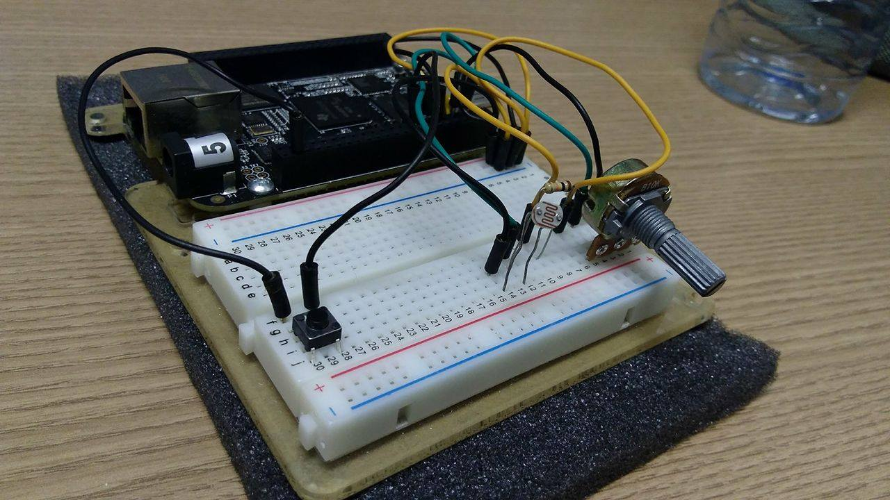

# About this fork:

## This is a fork of the "tetris-on-terminal" to implement a analogic controller on the game with a Beaglebone Black.

### Controls:

#### ADC:

- A potenciometer in /sys/bus/iio/devices/iio:device0/in_voltage1_raw

- A LDR sendor in /sys/bus/iio/devices/iio:device0/in_voltage3_raw

#### GPIO:

- An input button in /sys/class/gpio/gpio115;

### The full circuit on a proto-board:



# Hello on tetris-on-terminal
Tetis-on-terminal is a tetris game with CLI interface. I offer you classic tetris and cool "rainbow" mode. Try it out.


## How to install.

To get the tetris-on-terminal you need this dependencies:

1. Unix-like environment.
2. Ncurses library.
3. C++11 compiler (for example g++).

### Step 1: download sources.
```sh
    $ git clone https://github.com/cdkrot/tetris-on-terminal
    $ cd tetris-on-terminal
```

### Step 2: compile.
```sh
    $ make
```

### Step 3: run.
```sh
    $ ./bin/tetris-on-terminal
```

### Step 4: enjoy!
